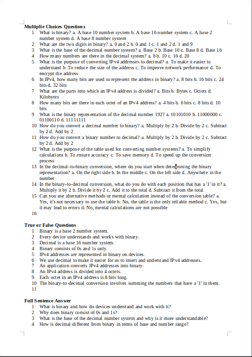

# ExamGeneratorChatGPT
**Generates Exams from Markdown Files Topics. Examns consists of every Topic of an Overtopic with 3 Type of Tasks [15 Multiplie Choice Questions, 10 True or False Questions, 15 Full Sentence Questions]**

There Programm is generally a Communication between a User and the Programm. The User acts as an Gateway to ChatGPT, because there is no API used for the Access to ChatGPT.

